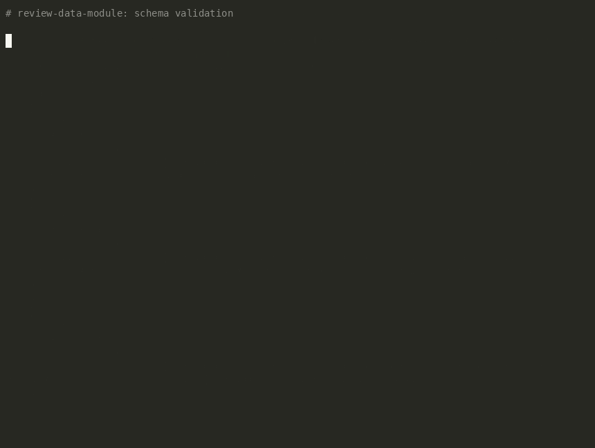

# S1000D MCP Server

[](https://github.com/i2oss/s1000d-mcp/actions/workflows/ci.yml)

An MCP (Model Context Protocol) server that gives an LLM agent a working toolset for
reviewing **S1000D** technical publications — the structured-authoring XML standard
used across aerospace and defense for maintenance and engineering documentation.



*A real terminal session (recorded with [asciinema](https://asciinema.org) + [agg](https://github.com/asciinema/agg), not staged) running the tools directly against this repo's sample corpus -- the same three checks `review-data-module` chains together.*

## The problem

S1000D content is authored as small, modular XML units called **data modules**, each
identified by a structured **Data Module Code (DMC)**, validated against publicly
published XML schemas, cross-referenced against other data modules and graphics, and
filtered by an **applicability** model that says which content applies to which
product variant or configuration. In a real authoring environment, tools like
Arbortext Editor, Windchill, and DevTrack handle schema validation, cross-reference
integrity, applicability checking, and change-impact tracking as separate, disjoint
steps in someone else's workflow.

This project reimplements the *spirit* of that tooling as a set of MCP tools an LLM
agent can call directly — and then chains those tools into a single agentic review
workflow via a `SKILL.md` — using a hand-built subset schema modeled on S1000D's
publicly documented structure (the official XSDs are only distributed through a
registered-user portal, not a plain download — see [Schema](#schema) below) and
entirely hand-built, non-proprietary sample data modules. No proprietary or
work-related content is used anywhere in this repository.

## Tools

| Tool | Status | Purpose |
|---|---|---|
| `validate_xml_schema` | ✅ implemented | Validate a data module against the project's subset S1000D XSD; return structured errors with line numbers. |
| `check_cross_references` | ✅ implemented | Parse a directory of data modules, build a DMC-keyed reference graph from their content, flag dangling references and orphaned modules. |
| `generate_data_module_skeleton` | ✅ implemented | Scaffold a new, schema-valid empty data module from a template, given DMC parts, info code, and title; self-validates before returning. |
| `check_applicability` | ✅ implemented | Check a data module's structured applicability assertions against a sample Applicability Cross-reference Table (ACT). |
| `suggest_fix` | ✅ implemented | Given a validation error and the target data module, call the Anthropic API (with an S1000D-authoring-rules system prompt and forced tool-use) for a suggested corrected XML snippet, a plain-English explanation, and a confidence level. |

On top of the individual tools, [`skills/review-data-module/SKILL.md`](skills/review-data-module/SKILL.md)
chains them into one workflow: validate → check cross-references → check applicability
→ `suggest_fix` for each concrete problem found → summarize findings in a report. It
never edits a file itself -- every suggested fix is shown to the user to review and
apply.

## Architecture

```
                         ┌─────────────────────────────┐
                         │   skills/review-data-module   │
                         │   SKILL.md (agentic workflow)  │
                         └───────────────┬────────────────┘
                                          │ chains, in order
        ┌─────────────────┬──────────────┼──────────────┬─────────────────┐
        ▼                 ▼              ▼               ▼                 ▼
 validate_xml_schema  check_cross_   generate_data_  check_          suggest_fix
                       references     module_skeleton applicability
        │                 │                              │               │
        └─────────┬───────┴──────────────────────────────┘               │
                   ▼                                                     │
         schemas/s1000d_mcp_subset.xsd                                   │
         schemas/s1000d_mcp_sample_act.xml                               │
         samples/**/*.XML  (fictional "Meridian M100" corpus)            │
                                                                          ▼
                                                          src/s1000d_mcp/prompts.py
                                                          (system prompt + forced
                                                           propose_fix tool schema)
                                                                          │
                                                                          ▼
                                                             Anthropic API (Claude)
```

`src/s1000d_mcp/server.py` is a single [MCP](https://modelcontextprotocol.io) server
(`MCPServer`, stdio transport) exposing the five tools above as `@mcp.tool()`
functions. Every tool takes plain paths/dicts, resolves relative paths against the
repo root, and returns a structured dict -- none of them raise on bad input (a missing
file, a malformed DMC, an unreachable API); errors and violations are always data in
the response, not exceptions, so an agent calling them never has to wrap every call in
a try/except to keep going. `suggest_fix` is the one tool with a network dependency
(the Anthropic API); its client construction and API call are factored into small,
separately-testable functions (`_get_anthropic_client`, `_call_propose_fix_api`,
`_extract_tool_input`) so the rest of the server has no hidden network calls.

`skills/review-data-module/SKILL.md` is what turns the five independent tools into an
actual review: it's instructions for an LLM agent (not more Python) describing the
order to call them in, how to read each one's output, when a finding is worth a
`suggest_fix` call, and how to summarize the results -- the same chain the demo GIF
above shows running by hand.

Each tool's tests live in a matching `tests/test_<tool>.py`, run against a shared
fixture set in `samples/` (see [Schema](#schema) below for what each subdirectory is
for) plus, for `suggest_fix`, a mocked Anthropic client so the suite never makes a
real network call.

## Schema

The official S1000D XSDs are distributed only through the S1000D Council's
registered-user portal (`users.s1000d.org`) — free to register, but not a
plain public download, so this repo can't redistribute or auto-fetch them.
Instead, [`schemas/s1000d_mcp_subset.xsd`](schemas/s1000d_mcp_subset.xsd) is a
hand-built schema that models the real structural shape of a data module
(DMC, language/issue metadata, title, status/security/applicability/BREX
reference, QA, and descriptive/procedural content with inline `dmRef` /
`graphicRef` cross-references) closely enough to exercise genuine schema
validation — required elements, element order, attribute patterns, and
enumerations — against realistic sample data. It is **not** one of the
official S1000D schemas; closing that gap (or adding a mode that points at a
real, user-supplied schema set) is a roadmap item.

The sample corpus in [`samples/`](samples/) is entirely fictional: a made-up
aircraft ("Meridian M100"), its auxiliary power unit, and a small fuel
subsystem. Three directories, each serving a different tool's tests:

- `samples/corpus/` — 7 schema-valid, interlinked data modules (an APU
  description, its remove/install inlet-filter procedures, an electrical
  interface description, a deliberately standalone maintenance-schedule
  description, and a two-module fuel-system pair that cross-references
  back into the APU description). Used by both `validate_xml_schema`
  (all pass) and `check_cross_references` (0 dangling references; 3
  modules come out orphaned because nothing in the corpus points to them).
- `samples/schema-invalid/` — 2 modules deliberately broken in different
  ways (bad DMC pattern + wrong element order; invalid enumeration +
  missing required element + malformed date), for `validate_xml_schema`'s
  failure path.
- `samples/broken-refs/` — a copy of the clean corpus with two `dmRef`
  targets deliberately pointed at DMCs that don't exist in the directory
  (one same-system, one cross-system), for `check_cross_references`'s
  failure path. Still fully schema-valid — a dangling reference is a
  semantic problem, not a schema violation.
- `samples/applicability-invalid/` — 2 modules, also fully schema-valid,
  that assert applicability the ACT rejects: one against an attribute the
  ACT never defines, one against a real attribute with a value outside
  its allowed set. For `check_applicability`'s failure path; two modules
  in `samples/corpus/` carry the passing case.

### Example

```
$ uv run python -c "
from s1000d_mcp.server import validate_xml_schema
import json
print(json.dumps(validate_xml_schema(
    'samples/schema-invalid/DMC-MERM100-A-BAD-00-00-00AA-040A-A_001-00_EN-US.XML'
), indent=2))
"
{
  "file": "/.../samples/schema-invalid/DMC-MERM100-A-BAD-00-00-00AA-040A-A_001-00_EN-US.XML",
  "schema": "/.../schemas/s1000d_mcp_subset.xsd",
  "valid": false,
  "errors": [
    {
      "line": 6,
      "column": 0,
      "level": "error",
      "message": "Element 'language': This element is not expected. Expected is ( dmCode )."
    }
  ]
}
```

## Applicability

[`schemas/s1000d_mcp_sample_act.xml`](schemas/s1000d_mcp_sample_act.xml) is a
small, hand-built Applicability Cross-reference Table: it defines three
product attributes for the fictional Meridian M100 (`engineVariant`,
`avionicsSuite`, `apuOption`) and each one's allowed values. A data module
may assert applicability against it with `<applicProperty
applicPropertyIdent="..." applicPropertyValue="..."/>` inside its `<applic>`
element -- an addition to the subset XSD made this week, backward
compatible with every earlier data module since it's optional and
repeatable. `check_applicability` checks those assertions and reports
unknown attributes and out-of-range values; a module with none is valid,
not flagged.

## LLM-assisted fixes

`suggest_fix(dm_path, error, model=None)` sends the full subset XSD schema, the full
target data module, and one specific finding (a schema error, a dangling
cross-reference, or an applicability violation -- any of the earlier tools' output
entries work as-is) to the Anthropic API. The system prompt in
[`src/s1000d_mcp/prompts.py`](src/s1000d_mcp/prompts.py) describes this project's
subset schema's actual structure, and the call forces a `propose_fix` tool use rather
than free text, so the response is always structured: an `explanation`, a
`corrected_xml` snippet, and a `confidence` level -- never a raw string to parse and
hope survived formatting.

The default model is **Claude Haiku 4.5** (`claude-haiku-4-5`) -- one data module plus
one error is a small, well-defined context per call, so a fast, inexpensive model is
the right default; override it per call with the `model` argument or globally with the
`ANTHROPIC_MODEL` environment variable. The API key is read from `ANTHROPIC_API_KEY`
in the environment (see [Setup](#setup) below) and is never hardcoded, logged, or
committed. `suggest_fix` never raises: a missing key, a missing file, or an API error
all come back as a structured `{"ok": false, "reason": "..."}` result instead of an
exception, matching every other tool in this server.

### Example (illustrative)

```
$ uv run python -c "
from s1000d_mcp.server import suggest_fix
import json
print(json.dumps(suggest_fix(
    'samples/schema-invalid/DMC-MERM100-A-049-00-00-00AA-041A-A_001-00_EN-US.XML',
    error={
        'line': 9,
        'column': 0,
        'level': 'error',
        'message': \"Element 'dmStatus', attribute 'issueType': 'obsolete' is not a valid value of the local atomic type.\",
    },
), indent=2))
"
{
  "ok": true,
  "file": "samples/schema-invalid/DMC-MERM100-A-049-00-00-00AA-041A-A_001-00_EN-US.XML",
  "model": "claude-haiku-4-5",
  "explanation": "The dmStatus element's issueType attribute was set to 'obsolete', which isn't one of the four values this subset schema allows (new, changed, revised, deleted). Based on the surrounding content this looks like a superseded issue, so 'deleted' is the closest valid match -- change it to that.",
  "corrected_xml": "<dmStatus issueType=\"deleted\">",
  "confidence": "medium"
}
```

(This response is illustrative, not a real API call -- it shows the shape of the
output, not an actual model completion. Run the command yourself with
`ANTHROPIC_API_KEY` set to see a real one.)

## Status

🚧 Early development — see the [roadmap](#roadmap) below and the repo's Issues for
what's in progress.

## Tech stack

- **Language:** Python (3.10+), managed with [uv](https://docs.astral.sh/uv/)
- **XML validation:** [`lxml`](https://lxml.de/) against the public S1000D XSD
- **LLM:** Anthropic API (Claude)
- **MCP:** the official [Python MCP SDK](https://github.com/modelcontextprotocol/python-sdk)
- **Testing:** `pytest`, against a small hand-built corpus of sample data modules
  (some valid, some deliberately broken)
- **CI:** GitHub Actions running `pytest` on push

## Setup

```bash
git clone https://github.com/i2oss/s1000d-mcp.git
cd s1000d-mcp
uv sync
```

`suggest_fix` needs an Anthropic API key. Copy the example env file and add your own:

```bash
cp .env.example .env
# then edit .env and set ANTHROPIC_API_KEY
```

`.env` is gitignored and only ever read locally -- every other tool works fine with no
key set at all.

Run the server:

```bash
uv run s1000d-mcp
```

### Using it with Claude Desktop / Claude Code

Add to your MCP client config (e.g. `claude_desktop_config.json`):

```json
{
  "mcpServers": {
    "s1000d": {
      "command": "uv",
      "args": ["--directory", "/absolute/path/to/s1000d-mcp", "run", "s1000d-mcp"]
    }
  }
}
```

## Roadmap

Weeks 1-6 built the core server; what's below `v0.1.0` is ongoing, tracked as
[GitHub Issues](https://github.com/i2oss/s1000d-mcp/issues) and closed incrementally
rather than treated as a single follow-up dump.

- [x] `validate_xml_schema` (schema validation)
- [x] `check_cross_references`
- [x] `generate_data_module_skeleton`
- [x] `check_applicability`
- [x] `suggest_fix`
- [x] `review-data-module` SKILL.md
- [ ] GitHub Actions CI
- [ ] `v0.1.0` release
- [ ] DITA schema support
- [ ] Simplified Technical English (STE)-style rule linting
- [ ] CLI wrapper

## About

Built by [Ross Shelton](https://rwshelton.com) as a demonstration of agentic AI
development — MCP tooling and Claude `SKILL.md` workflows — applied to a real
technical-documentation problem, drawing on experience authoring S1000D-compliant
content professionally. All sample data modules in this repo are fictional and
non-proprietary.

## License

MIT — see [LICENSE](LICENSE).
